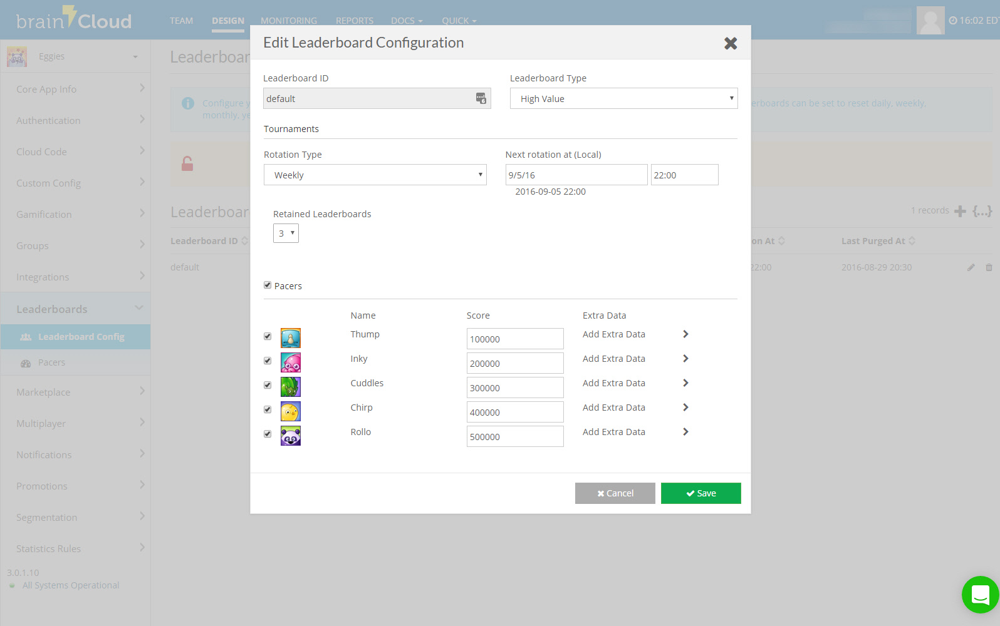

## Leaderboards

brainCloud provides support for both _global_ and _social_ leaderboards.

brainCloud leaderboards support the following:

- Games can have an unlimited number of leaderboards
- Single score entry for both global and social leaderboards
- Supported score types include "High Value", "Low Value", "Cumulative" and "Last Entry"
- Leaderboard entries can include additional "developer-defined" data
- Leaderboards can be configured to automatically reset daily, weekly, monthly or yearly
- brainCloud provides rich APIs for dynamically creating leaderboards, retrieving data for social maps, and more

brainCloud also supports Pacers to make leaderboards more compelling for players that are not connected to social networks.  Pacers are "canned" score entries that are automatically populated on a leaderboard with set score values.  These can be used to give the player a crew of game-provided avatars to compete against.

For more information, check out the [Leaderboard API](/api/capi/leaderboard).

## Tournaments

brainCloud’s new _Global Tournaments_ feature is an entirely new system designed to amplify player engagement in your games.

Global Tournaments are suitable for any game where competition centers around leaderboards. In fact, in their simplest form, global tournaments can be thought of simply as prize rules added to a leaderboard.

The power of brainCloud’s tournament system comes from how flexible they are, coupled with how much they do for you. Features include:

- Free or Paid – brainCloud collects the entry fee for you
- Flexible Prizes – award any combination of currencies, XP, stats and achievements – brainCloud handles it all
- Tournament Cycles – set your tournament to daily, weekly, monthly or an arbitrary number of days
- Tournament Phases – optionally have an exclusive registration vs. play phase – and set up downtime between tournaments
- Notifications – both Push and Email-based notifications – automatically sent by brainCloud throughout the tournament cycle
- Portal Support – configure tournament templates and attach them to leaderboards. And then view tournament results straight from the Leaderboard monitoring screens
- New Tournaments API – for fine control of displaying tournament information, handling player enrollment, recording player scores, and claiming awarded prizes
- And of course, you can use brainCloud Global Tournament features as building blocks for more advanced tournament variations – for example, tournaments brackets.

For more information on Global Tournaments, check out our [Tournament API](/api/capi/tournament).
