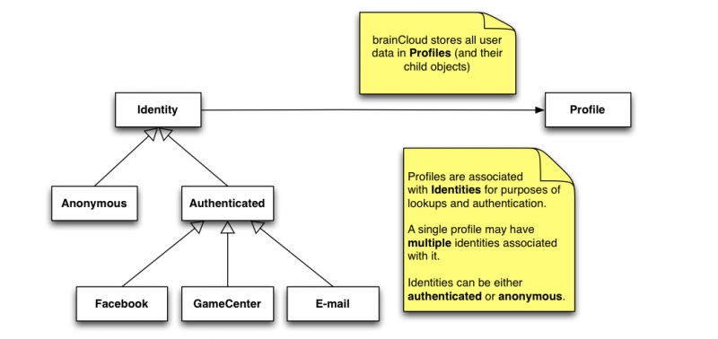
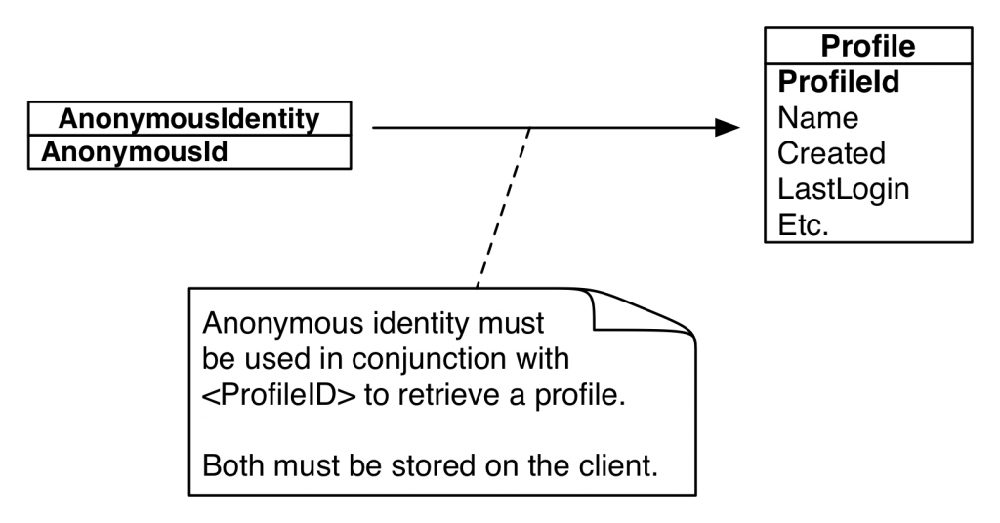
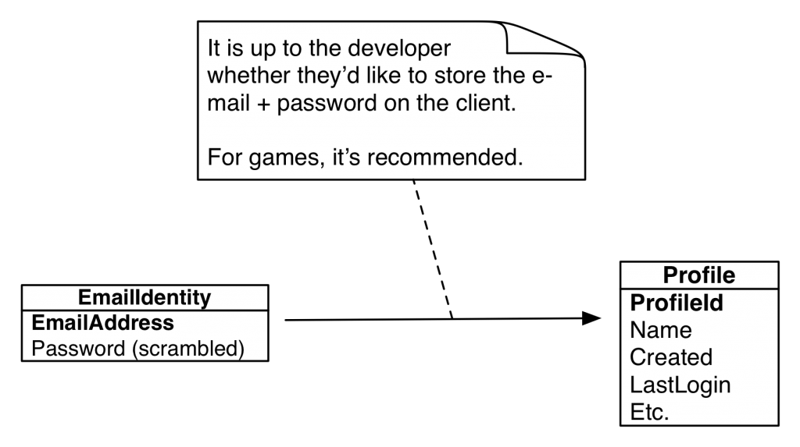

A BaaS is only as flexible as its identity system - and brainCloud is very flexible indeed. The brainCloud authentication and identity APIs have been designed with the following goals in mind:

- Allow developers to include both anonymous and authenticated access to their apps
- Allow access to multiple authentication mechanisms - so as not to alienate any significant user bases
- Include support for merging accounts (which is commonly needed when games are offered across various device platforms)

brainCloud supports the following types of identities:

- Anonymous
- Authenticated
    - Facebook
    - Twitter
    - Game Center (iOS)
    - Google Play Services
    - E-mail + Password
    - Universal Userid + Password _(meant for development primarily - has limitations)_
    - Steam

And we're always adding new ones!  (Indeed, we've recently added support for [External Authentication](/learn/key-concepts/authentication/external-authentication/) and [Shared Accounts](/learn/key-concepts/authentication/shared-accounts/) as well!)

_Important note - there are no global brainCloud Accounts for end-users.  All end-user accounts (profiles) are local to the app they are associated with - we do this so that you completely_ _own_ _your end-user data, and there is no branding-confusion regarding the accounts._

* * *

[](images/brainCloud_api_diagrams.png)

* * *

# Key Concepts

These key concepts are essential to understanding brainCloud authentication:

1. **Profile** - all the key information about a user in your game or app is stored in the **Profile**.  The profile is the key record for locating a users stats, entities, achievements, currency balances, etc.
2. **Identities** - brainCloud uses identities to locate profiles.  Every brainCloud profile has at least *one* identity (the anonymous identity) associated with it - but it may have others (including a Facebook identity, Game Center identity, etc.)
3. **Logging in** - when your app starts, it logs into brainCloud by providing an identity for brainCloud to use to locate the appropriate profile.
4. **Advanced operations** - brainCloud provides advanced APIs to allow you to add additional identities to a profile after it's been created - and can even allow you to merge profiles where necessary.

# Creating Profiles

**There is no explicit _Create()_ and _Delete()_ methods for brainCloud profiles** - instead, they are automatically created during authentication if an existing profile cannot be found.

Essentially, the client attempts to log into brainCloud using the selected authentication mechanism - and if an existing profile is not located, a new one will automatically be created.  _[Technically speaking, the developer *can* choose to override this behavior by passing a FALSE to the forceCreate parameter, but that's not common usage.]_ 

Here's an example using anonymous authentication.
```js
// Authenticate with brainCloud anonymously
// - if a profile for this anonymous id isn't found, create it
BrainCloudWrapper.GetInstance().AuthenticateAnonymous(
     true,
     OnSuccess_Authenticate,
     OnError_Authenticate);
```
# Anonymous Identity and Profile Ids

As we mentioned above, **Identities** are used to lookup **Profiles**.  A key feature of brainCloud is that it supports user anonymity - so that even if users choose not to identify themselves, we can still associate them with their profile in our system.

To support this, brainCloud generates completely random (GUID-based) ids that are used to identify the device that a profile is connected to.  We generate (and have the client store) this id so that we're not breaking any rules about identifying users without their permission - e.g. the same reason developers are no longer allowed to use UDIDs in iOS.

To keep things secure, the <AnonymousIdentity\> must be used in conjunction with the <ProfileId\> to look up the profile. Yes, you got that right - to look up a profile anonymously, you need to *already* have the profile's id - which you get when the profile is first created. Honestly, this isn't as crazy as it sounds - by requiring these two pieces of information we're preventing folks from hacking into our system and accessing any arbitrary user profile via a single identifier.

The nice thing is that the **BrainCloudWrapper** class stores both the <AnonymousIdentity\> and the <ProfileId\> for you - so you don't normally have to worry about it.

[](images/brainCloud-Anonymous-Identity-1024x536.png)

Anonymous identities are convenient - you don't need to bother your user with a login, yet can still persist their data on the cloud - but there are some significant disadvantages.

#### Cons of Anonymous Identification

- The user's cloud data will become inaccessible if they lose or wipe their device
- The user cannot access their profile from multiple devices (we're working on that)
- It is more difficult to participate in social features (i.e. friends, invites, etc.)

# Authenticated Identities

brainCloud also supports a variety of authenticated identities - including Facebook, E-mail + Password, etc.  With authentication comes significant advantages:

#### Pros of Authenticated Identification

- The user's data is accessible across devices
- The user's data is restorable even if they wipe or lose their device
- Depending upon the authentication type, the user will be able to use social features

# E-mail Authentication

E-mail authentication is convenient and ubiquitous - and a great addition to most apps.

The e-mail authentication flow allows the app to prompt the user for an e-mail and password to use for an account.  The e-mail and password (which is one-way scrambled) will be stored on the server.



During the initial authentication, if the e-mail identity doesn't exist in the system, it will be created, along with the user's profile.  brainCloud will also send an e-mail to the user at the address provided, to confirm that they have indeed entered the correct e-mail address. This is important for invoking the "forgot password" flow in the future, should it be needed.

The e-mail validation feature is recommended, but optional (the developer can turn it off).  The developer can also choose whether or not the e-mail address must be validated before we allow the user into the app (that depends upon the type of app - for games, we recommend not enforcing validation).

# Universal Authentication

Universal Authentication is a lot like E-mail Authentication, except that the userid doesn't have to be an e-mail address.  As a result, however, end-users have no recourse if they forget their password (or at least we haven't designed on yet - I suppose we could add security questions).

But for now, this form of authentication can be useful during development - but **we do not recommend it for production**.

# Facebook, Google Play, Twitter and Steam Authentication

brainCloud also supports authentication with third-party services, such as Facebook, Twitter, Steam, etc.. The advantage of using these identities is better integration with those platforms (of course), plus the fact that the user doesn't need to create and remember the password for yet another account.

Adding third-party authentication to your app requires a bit more work - although brainCloud does everything you need on the server side, we have not wrapped the various SDKs on the client (there are too many, and they change too often - maybe in the future!).

So, for now, the developer is responsible for integrating the platform's client SDK into their app, and for validating the user with the SDK before sending the appropriate identity information to brainCloud (where it will once-again be validated server-side).

For example, the steps for Facebook look like this:

- Initialize Facebook SDK
- Authenticate with Facebook
- Call the brainCloud **AuthenticateFacebook()** method, passing in the Facebook <externalId\> and <authenticationToken\> (along with the rest of the standard brainCloud authentication parameters)
- the brainCloud servers will re-validate the Facebook identity, and use it to look up the user's profile

brainCloud does not store (or even ask for) the password to the third party account.

Note - the client app is responsible for persisting the 3rd party's user id info if desired / required (e.g. for Facebook, the <externalId\> and <authenticationToken\>).

Note - when authenticating with Facebook, you must request _**user_friends**_ among your permissions to make use of social network support (e.g., social leaderboards).

# GameCenter Authentication

Finally, brainCloud also supports GameCenter authentication - on Apple devices only, of course.

GameCenter authentication works similarly to other Third Party integration, except that the <gameCenterId\> is more readily available and has already been validated.

It is recommended that Apple apps use GameCenter Authentication instead of Anonymous Authentication whenever possible - since it has the same pros as anonymous authentication (the user is not bothered with logging in, and doesn't give up any personal data) without most of the cons (the user's data will still be retrievable after a wipe, and will be accessible across multiple _Apple_ devices).

# Upgrading Authentication

Most games/apps will probably want to allow their users to be anonymous initially.  Given an upfront account setup when creating an account can be bothersome, and it will cause a portion of your userbase to abandon the app before they start.

Luckily, brainCloud supports this concept directly.  brainCloud allows the app to add additional identities to a profile *after* the profile has been created - this is often done by:

- encouraging the user to connect to Facebook to play with friends
- encouraging the user to create an account (e-mail + password) to save their data
- etc.

Adding additional identities to a profile is accomplished via the AttachIdentity() methods, which can be found [here](/api/capi/identity).  Identities can also be detached (if the user decides to disconnect from Facebook, etc.).

Once a user has upgraded from an anonymous account to an authenticated account (because they're now using an authenticated identity), you should switch to retrieving their account via the appropriate authenticated authentication call (instead of the anonymous call).

<DocCardList />