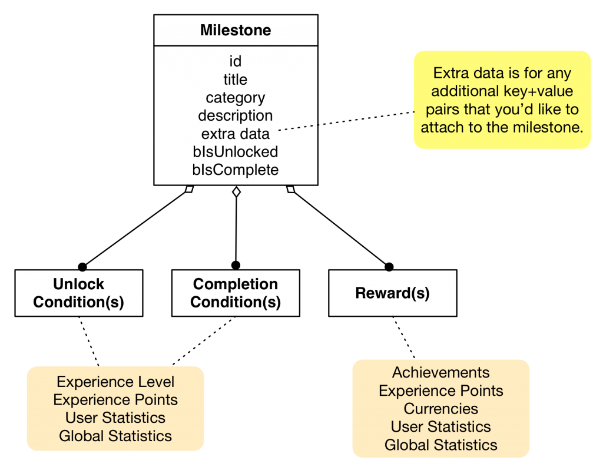
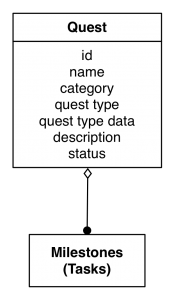

brainCloud's Gamification features provide server-side support common metagame elements, including:

- Experience Points (XP) and Levels
- Achievements
- Milestones
- Quests
- Stats Events

These features build upon the Statistics APIs and a concept of Player Rewards.

_**Player Rewards**_

brainCloud provides an ability to reward players for completing meta-goals: leveling up, completing a milestone and/or completing quests.  Rewards can consist of:

- Achievements
- Experience Points
- Currencies
- User Statistics
- Global Statistics

* * *

## XP Levels

brainCloud can manage experience points (XP) and levels, and reward the player for leveling up. A player's XP starts at 0 and is incremented using methods of the [Player Statistics](/api/capi/playerstats) service. A list of player XP levels can be read from the client using [ReadXPLevelsMetaData()](/api/capi/gamification/readxplevelsmetadata).  

* * *

## Achievements

Achievements can be triggered manually, or as the result of player rewards. Achievements can be data filled with the ids for platform achievements (on iOS, Steam, etc.) so that they may automatically be triggered in sync with brainCloud achievements.

Achievements can be awarded directly using the [AwardAchievements()](/api/capi/gamification/awardachievements) API.  There are also API calls for retrieving the full list of achievements, and the list of achievements that have already been awarded for the player.

* * *

## Milestones

Milestones are used to define conditions under which rewards are to be delivered.  Milestones must first be unlocked before they can be completed and then awarded.

* * *

## Quests

Quests are essentially compound Milestones. The completion status of the Quest is derived from the completion status of the Milestones (Tasks) that it is composed of.

* * *

## Stats Events

Stats Events are essentially Stats Macros.  The Macro is defined on the server and triggered by id from the client.

For the same flexibility, but controlled directly from the client, try using the [ProcessStatistics()](/api/capi/playerstats/processstatistics) API.

<DocCardList />