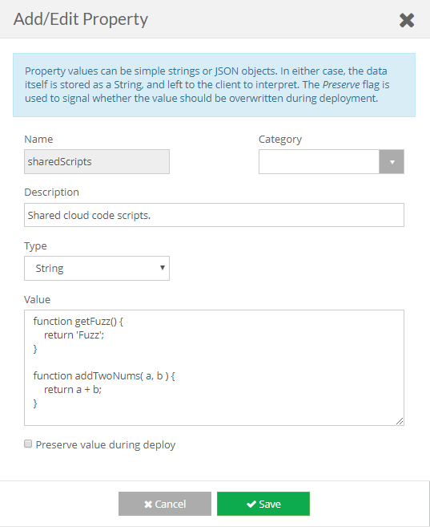

## Purpose

Script shows how you can use brainCloud properties to share scripts between cloud code.

## Warning

This has been tested with up to 30k bytes of code.

That said, isn't an officially sanctioned approach. We don't recommend putting more than **20-25kb** in the shared code string.

## Script

Click [TestSharedFunctions.ccjs.zip](script/TestSharedFunctions.ccjs.zip) to download the file.

## Usage / Setup

Add a Global Property with the scripts you want to share.

Properties can be set on the **Design | Custom Config | [Global Properties](https://portal.braincloudservers.com/admin/dashboard#/development/global-properties)** page.

The example test script assumes a `getFuzz` and `addTwoNums` functions exist.
```js
function getFuzz() {
    return 'Fuzz';
}

function addTwoNums( a, b ) {
    return a + b;
}
```


To configure this script, simply import it into your app.

Authenticate, and run the script.

This is the response you should get.
```js
{
  "data": {
    "response": {
      "getFuzz": "Fuzz",
      "sum": 15
    },
    "success": true
  },
  "status": 200
}
```