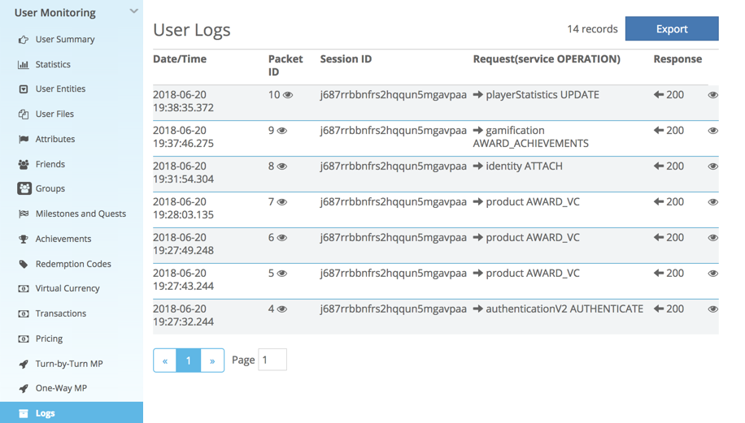
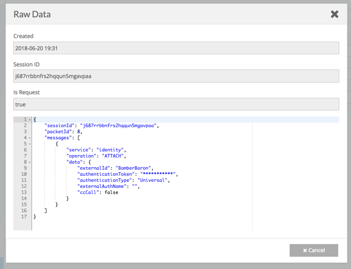

Another feature of the User Monitoring section is the ability to review the logs of an individual user.  The logs contain any recent brainCloud requests and responses by the user. This is very useful for debugging during development.

After finding and selecting a User the logs can be viewed by going to the Logs tab at the bottom of the sidebar.

You can now see all the selected User's recent requests and responses sorted by most recent.

- **Date/Time** - The time and date that the request was issued by the User.
- **Packet ID** - The packet ID increments with each request the User makes.  By clicking the eye icon to the right of the ID you can view the raw request information that was sent to the server.
- **Session ID** - A unique ID created every time the User authenticates and persists until they re-authenticate, log out, or their session expires from inactivity.
- **Request(service OPERATION)** - The API operation contained in the call in the format (serviceName OPERATION_NAME).
- **Response** - The response code issued by the server.  Anything other than 200 indicates an error was returned.  Like with the Packet ID, clicking the eye to the right of the response will open a window containing the raw data returned in the response.

Sometimes you may see multiple Requests in a single Packet.  The client will often bundle multiple requests into one Packet when they are issued very close together.  The result is visible in the logs as a Packet with multiple Requests.  In this case, the Response is also bundled before it's returned to the client.

