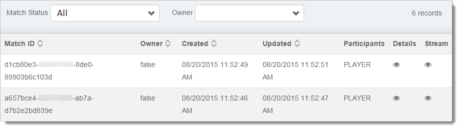

The One-Way MP tab allows you to view the status of recent one-way multiplayer matches involving the selected User.

The **Match Status** dropdown lets you filter records by their status.  **Owner** allows you to filter the results further by showing results for the player who started the match.

- **Match ID** - The unique ID generated for the match.
- **Owner** - Whether you are the owner of the match.
- **Created** - The date and time the match was created.
- **Updated** - The date and time of the last update to the match.
- **Participants** - The names of both players involved in the match.  If a player has no Player Name saved this will be blank.
- **Details -** Clicking on the eye icon will open a more detailed view of the match including the Player IDs of the users in the match.
- **Stream** - Contains all the data transferred in the match including the Match Summary, shared data, and the raw Playback Stream events.
