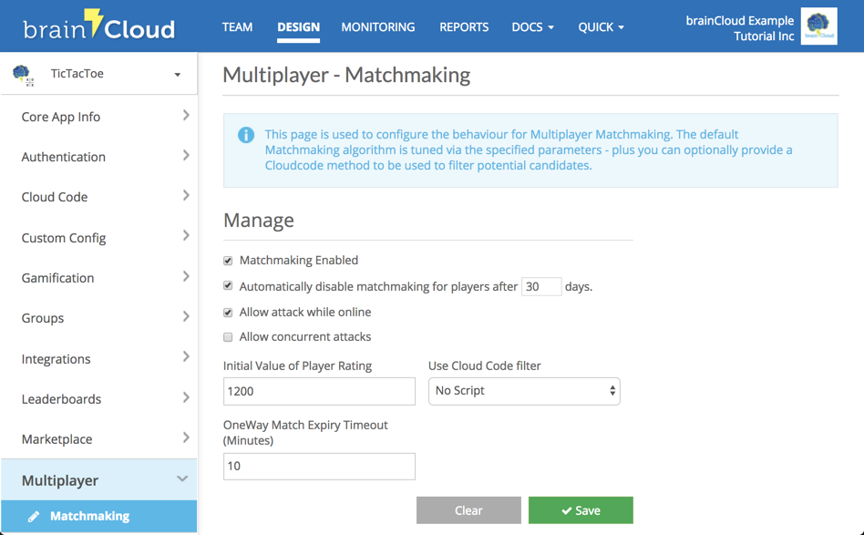
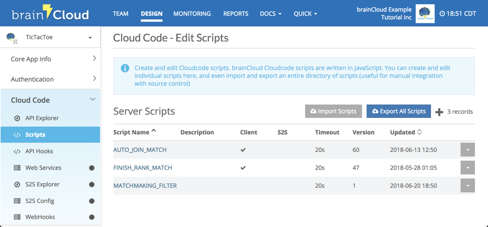

## Overview

The [MatchMaking](/api/capi/matchmaking) API is used to find players for multiplayer matches. Once a player has been found using the MatchMaking API, that player can be used for starting a match using either the [BrainCloudOneWayMatch](/api/capi/onewaymatch) API or the [BrainCloudAsyncMatch](/api/capi/asyncmatch) API. For an overview of the different types of multiplayer matches please refer to the [Multiplayer](/learn/key-concepts/multiplayer/) documentation.

## Finding Players

In order for players to be eligible for MatchMaking your app must do the following:

### Portal Setup

- Click the Matchmaking page, under **Design | Multiplayer | Matchmaking**
- Check the "Matchmaking Enabled" option

[](images/2018-06-20_19-47-01.png)

### BrainCloudClient API

After enabling MatchMaking in the brainCloud portal, you also need to enable MatchMaking for your player. When you've authenticated as the player you will need to:

- Call [MatchMaking.EnableMatchMaking](/api/capi/matchmaking/enablematchmaking) to allow the player to be considered for matches
- Optionally set a player rating. See below for more information on player ratings

Your player should now be considered for matches.

## Player Eligibility

There are a number of factors which affect player eligibility for MatchMaking.

### Player Session

If a player has a current session with brainCloud, they are by default ineligible for a match. This behavior can be modified by setting the "Allow attack while online" flag to true in the portal MatchMaking section.

Note that while developing/debugging, it may be useful to set this flag to true - especially when using the API explorer to test the functionality. Otherwise, players who have a current session will be ignored for MatchMaking. Players will have to explicitly log out from brainCloud to be eligible for matches, or wait for their session to timeout (default is 20 minutes - configurable in the portal).

### Player Rating

All players in the system have a rating. The initial value can be specified in the portal MatchMaking section. The player rating can also be affected through the MatchMaking API functions [IncrementPlayerRating](/api/capi/matchmaking/incrementplayerrating) and [DecrementPlayerRating](/api/capi/matchmaking/decrementplayerrating).

When a request is made through MatchMaking to GetOneWayPlayers, a "rangeDelta" parameter is supplied which limits the range of player ratings that are eligible, in relation to the currently authenticated player's rating.

To illustrate this point, let's assume the following ratings:

- Player A 1000
- Player B 1100
- Player C 850

If player A requests matches with a rangeDelta of 100,  only player B will be eligible.

You can also request your MatchMaking details by calling the Read API.

### Player Shield

Players in brainCloud can turn on a shield which prevents them from being matched. The MatchMaking API exposes functions to:

- TurnShieldOn
- TurnShieldOff
- TurnShieldOnFor (with the caller supplying a time in minutes)

You can also query the remaining shield time by calling [GetShieldExpiry](/api/capi/matchmaking/getshieldexpiry).

## Filtering Player Eligibility With Cloud Code

brainCloud supports filtering players by custom cloud scripts. In order to filter players using cloud code, follow these steps:

- Navigate to Edit Scripts in the Cloud Code section of the portal
- Create a cloud script - we'll call ours "MATCHMAKING_FILTER"
    - Client Callable should be set to false
- Below is an example matchmaking filter script. Note that the return value is true or false depending on whether the player should be matched. Note also the two input parameters in the "data" variable
    - matchCandidate - The player object. This returns the same JSON as the MatchMaking.Read API call (see below).
    - extraParms - The JSON extraParms object sent in the GetOneWayPlayersFilter API method. This is defined by the API method caller and can be used to help drive the custom filter results.

[](images/2018-06-20_19-51-23.png)
```js
var matchCandidate = data["matchCandidate"];
var extraParms    = data["extraParms"];

var retval = false;

var playerID = matchCandidate["playerId"];
var otherPlayerSession = bridge.getSessionForProfile(playerID);

// Now you can use the "otherPlayerSession" to execute API calls as that user.
// For instance you could check some of their entity data or verify that they
// have certain statistics that match the data in extraParams.

// retVal of false indicates this player is not valid for matching
retval;
```
For reference, the MatchMaking matchCandidate object is similar to the following (returns the same fields as the "findPlayers" API):
```js
{
 "matchCandidate": {
  "playerId": "89a0e12b-d910-4f5a-9e20-206017849754",
  "playerName": "",
  "pictureUrl": null,
  "summaryFriendData": null,
  "playerRating": 0,
 }
}
```