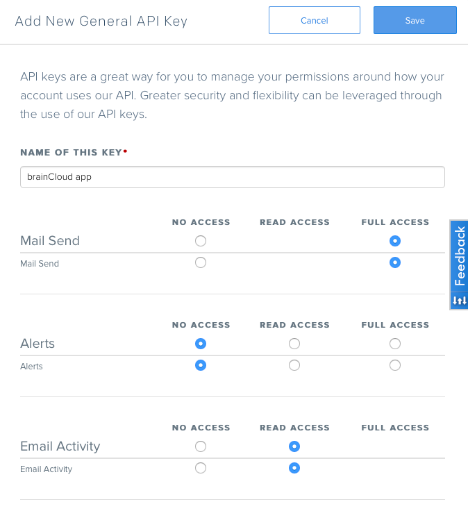
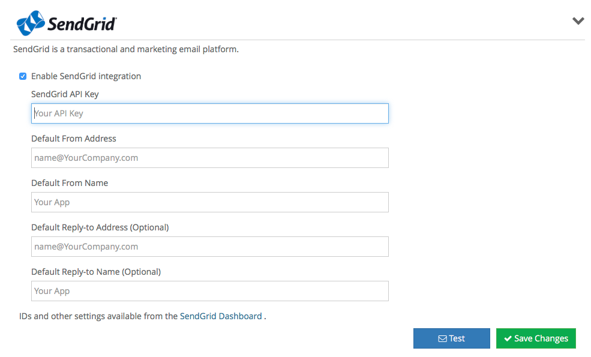
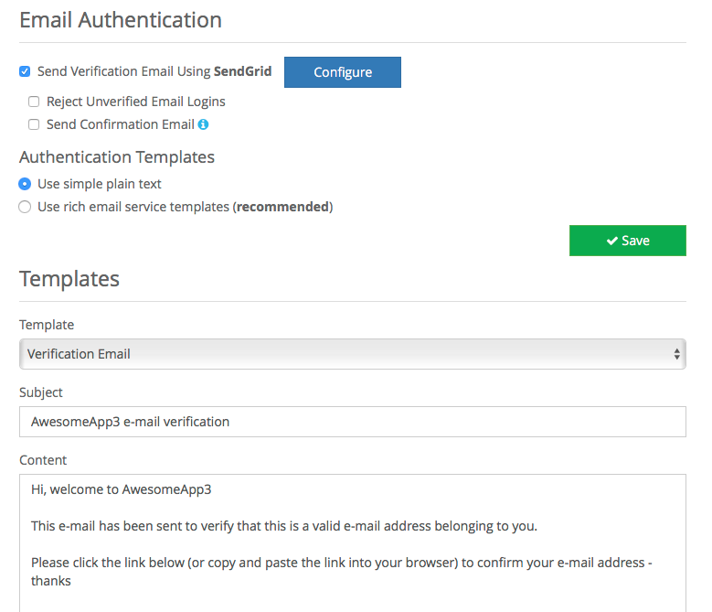
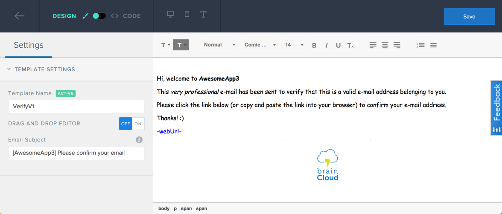

## Background

brainCloud 3.1 introduced SendGrid transaction email integration. By integrating brainCloud with their own SendGrid account, app developers can:

- Utilize SendGrid for all Email Authentication-related emails (validation, reset password, etc.)
- Customize the brainCloud-generated emails using SendGrids template feature
- Send emails to users via the new brainCloud Mail API

## Setup

The following sections will guide you through the process of integrating SendGrid with brainCloud.

### Step 1 - Create a SendGrid account

If you haven't already, go to [http://sendgrid.com](https://app.sendgrid.com/signup?id=8b9ae93b-ce8a-11e4-b4e5-5fcde71ee009) and create an account.  SendGrid offers free accounts that allow you to send up to 12,000 emails per month.

### Step 2 - Create a SendGrid API Key

Note - it can take a few hours for SendGrid to provision your new account - during which time you will be unable to access your SendGrid application ID.

- Log into **SendGrid.**
- Choose the **Settings | API Keys** page from the left-hand menu.
- Click on **[Create API Key]** in the top-right - choosing the _General API Key_ option.
- Give the key a **Name** - for example, "brainCloud app".
- Configure the **Permissions** for the API key.  
    SendGrid's documentation isn't great in this area. We normally recommend giving your API Key the following minimal permissions:
    - Mail Send - Full Access
    - Email Activity - Read Access
    - Suppressions - Full Access
    - Whitelabel - Full Access
    - Template Engine - Full Access
    - Inbound Parse - Full Access (for future use - spoiler!)
    - Marketing Campaigns - Full Access (future use)
- Hit **[Save]**, and copy the API Key into your clipboard or a document for safe keeping.

### Step 3 - Configure the SendGrid Integration in brainCloud

- Log into the brainCloud Portal.
- Go to **Design | Integrations | Manage Integrations**, and scroll down to the SendGrid integration.
- Click **[x] Enable SendGrid Integration**, and enter the _SendGrid API Key_ that you created in Step 2.
- Enter in a _Default From Address_ (email) and _Default From Name_ to use in emails sent from your app.  You can optionally fill in the Reply-To fields as well.
- Click the **[Test]** button to validate that everything is hooked up properly. brainCloud should send a test email to the email address that you've used to log into the portal.
- Once you've confirmed that the email was sent, click the **[Save]** button to save the configuration and activate the SendGrid integration.

### Step 4 - Enable Email Verification

If your app is using Email Authentication, and you'd like to validate the user's email when they create an account, you can do so using our Email Authentication service.

Enabling verification using plain text emails is quick and simple:

- Go to **Design | Authentication | Email Authentication** in the portal.
- Click **[x] Send Verification Email Using Sendgrid** to enable sending a verification email to users that create new accounts using their email identity. The email sent to them will contain a link to click to confirm their email address.
- Enable **[x] Reject Unverified Email Login**s to prevent users from logging into their app until they have clicked the link.
- Enable **[x] Send Confirmation Email** to send a final confirmation to the user after they have clicked the link, and successfully signed up to your app. This is a useful time to welcome them to your app, and also helps your email "bounce" ratio (which you have to watch so that your email endpoint doesn't get mistaken for a spam account).

Then confirm your email templates:

- For now, we assume that you have selected **(x) Use Simple Plain Text** emails.
- Customize the contents of the email templates. Use the Template combo-box to cycle between the different templates. Click on the [+ Add Language] button on the bottom to add additional languages.
- Click [Test] to test individual templates.
- Click [Save] when you are happy with your changes.

### Step 5 - Create SendGrid Templates

The real power of integrating with SendGrid lies in using custom, professional templates in your app.

We won't go through all the ins and outs of creating templates in SendGrid, but we'll take you through the basics:

- Log into SendGrid
- Choose the **Templates | Transactional** feature from the left-hand menu
- Click **[Create Template]**
- Enter a **Name** for the template - for example, "brainCloud Email Verification"
- Now choose **\+ Add Version** from the **Actions** menu.
- Enter a **Version Name** in the _Template Name_ field of the left-hand menu. I would suggest "VerifyV1".  
    _[Note - this terminology from SendGrid is confusing, and they seem to use it inconsistently. The basics are that a template can have multiple versions, only one of which will be active.]_
- Edit the **Email Subject** - you should identify your app and the purpose of the email
- Use the editor to **create your template**.  You could use some variation of the text below.
- You'll need to use a substitution parameter to ensure that the web-url gets placed in your email. The valid parameters are listed at the bottom of this page.  For now, add "-weburl-" to the bottom of the page.
- Click **[Save]** to save the template, and then the **left-arrow** on the left-hand side of the screen to exit the editor.
- In the templates list screen, click on the **action button** of the template version, and choose **[Preview & Test]**. Then click **[Send Test],** and then **[Send]** to send yourself a raw test email (without substitution). Click **[Cancel]** to exit the screen.

While you're at it, you should create the templates for the _Reset Password_ and _Confirmation_ emails as well. When configuring Rich Templates for email authentication, you must configure all templates for a language at the same time.

Suggested text for _Reset Password_ is:

Hi,

This e-mail has been sent automatically by AwesomeApp3 based on your request to reset your forgotten password.

To reset your password please click on the link below (or copy and paste the link into your browser) and then enter your new password.

If you did not forget your password, please ignore this e-mail.

{{webUrl}}

For the confirmation app, the suggested text is totally up to you. Just thank them for registering for your app, and tell them where to get more info!

### Step 6 - Configure the Rich Templates in brainCloud

Now that we've created our SendGrid templates, let's hook them up.

- Go to **Design | Authentication | Email Authentication** in the brainCloud Portal
- Select **(x) Use rich email service templates**
- Go to the _Verification Email_ combo box, and choose the appropriate template from the list. Click **[Test]** to send yourself a test email.
- Do the same for the _Password Reset_ and _Verification Confirmation_ settings, and then click **[Save]**

Voila! You are all set!

### Step 7 - [Optional] Send email from your app!

You can also send emails to users programmatically. Check out our new [Mail Service](/api/capi/mail) APIs!
