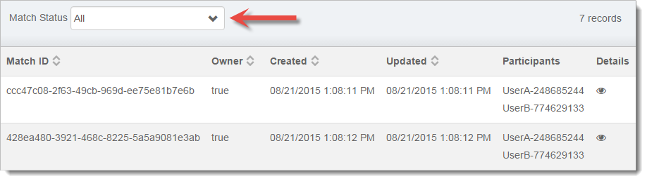

The Turn-By-Turn Multiplayer page allows you to view the status of any turn-based matches that the selected User has participated in.

The **Match Status** dropdown allows you to filter the records displayed in the list.

- **Match ID** – The unique ID generated for the match.
- **Owner** – Whether you are the owner of the match.
- **Created** – The date and time the match was created.
- **Updated** – The date and time of the last update to the match.
- **Participants** – The names of both players involved in the match.  If a player has no Player Name saved this will report Unknown Name.
- **Details**– Contains all the data transferred in the match including the Match Summary, shared data, the Player IDs of the users in the match, and the raw Playback Stream events.
