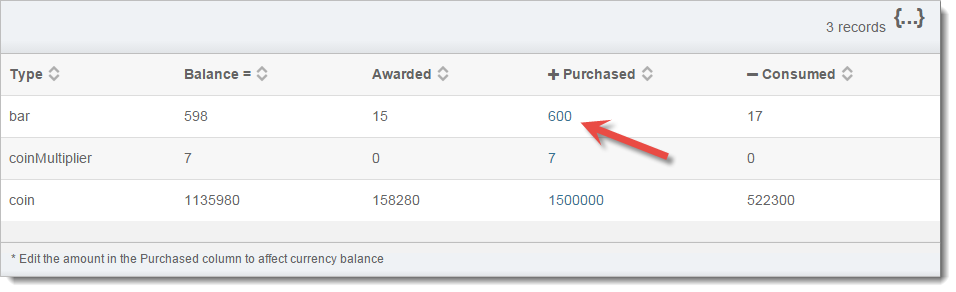
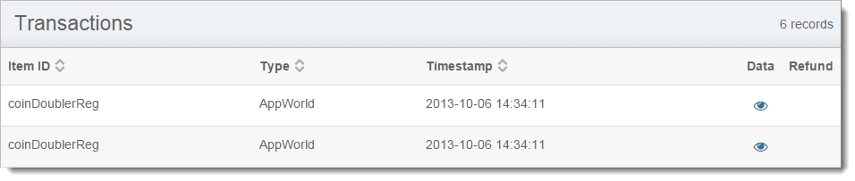

The Virtual Currency tab lets you view and potentially edit the user's virtual currency balances.

The first section of the page lists all the app's currencies and the selected User's stats related to them.  **Balance** is the quantity of currency the User currently possesses.  **Awarded** counts the currency gained though rewards from Milestones, Quests, Achievements, etc.  **Purchased** indicates the total amount of currency gained through purchasing products in marketplace transactions.  **Consumed** represents the total amount of currency that has been spent by the User.  **Editing currency** is possible by clicking the Purchased number.

To see the raw JSON for all the currencies listed click the **{…}** icon beside the total record count at the top right.

The Transactions section lists all the Product transactions from various marketplaces (iTunes, Facebook, etc).  **Item ID** is the ID of the Product that was purchased.  **Type** indicates the type of marketplace the purchase originated from.  **Timestamp** is the time and date the transaction took place at.  **Data** allows you to view the raw transaction data by clicking the eye icon.  **Refund** indicates whether a transaction has been refunded to the User.
