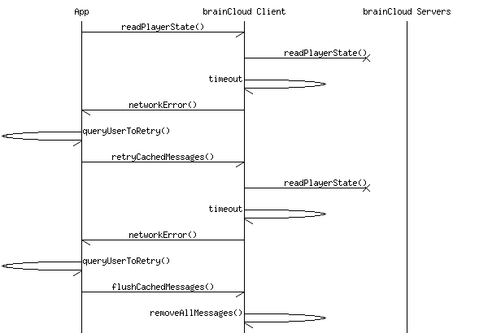

The Network Error Message Caching feature in the brainCloud SDK allows developers to centralize their handling of network outages. Mobile devices are prone to dropping network connections. As such, it's important to handle network outages with the brainCloud server gracefully. The Network Error Message Caching system aims to make this an easier task.

## The Problem

The brainCloud SDK provides granular error handling by allowing developers to register callbacks for almost any API call offered by the system. Your error handling routines may be specific to an API call, and to facilitate this granular handling of errors, brainCloud allows you to register unique callbacks per API call. However, this becomes somewhat problematic when dealing with network outages. For instance, you may have 5 API calls which are in transit to the brainCloud server. Without the Network Error Message Caching, each error handler for those 5 API calls will be executed in turn. How would you determine which error callback gets to "take charge" when a network error happens?

## The Solution

To solve this issue, brainCloud provides a single **Network Error** callback which is called when a network error is encountered. brainCloud also caches all in transit messages while the error is being handled (for instance a dialog is presented to the user to retry/cancel their connection). Once the Network Error callback has been issued, the developer can decide to **RetryCachedMessages** which causes the brainCloud SDK to attempt to resend the messages or **FlushCachedMessages** which discards all cached messages.

The basic flow is as follows:

## Implementation

Here are the steps to use the Network Error Message Cache:

1. Enable the network error message caching using [EnableNetworkErrorMessageCaching()](/api/capi/client/enablenetworkerrormessagecaching)
2. Register a network error callback using [RegisterNetworkErrorCallback()](/api/capi/client/registernetworkerrorcallback)
3. On receiving a network error callback either
    1. Call [RetryCachedMessages()](/api/capi/client/retrycachedmessages) to attempt a retry or,
    2. Call [FlushCachedMessages()](/api/capi/client/flushcachedmessages) to flush all messages

Note that once you enable network message caching, **all messages to brainCloud** will be cached upon a network error callback being raised. Until your app takes an action to retry or flush, no messages will be sent to brainCloud.
