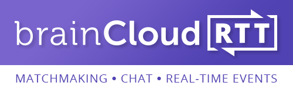

**RTT** is the new _Real-Time Technology_ extension of BRAINCLOUD.

RTT adds a real-time channel to the BRAINCLOUD client libraries. This channel allows clients to _listen for_ and _react to_ real-time events – without polling.

This opens up a slew of new features:

- Real-time Events  
    
- Real-time Messaging  
    
- Online Chat  
    
- Online Lobbies & Matchmaking  
    
- Custom Multiplayer Servers  
    
- and more!

_Note - BRAINCLOUD RTT is optional, and included in select BRAINCLOUD Subscription Plans._
