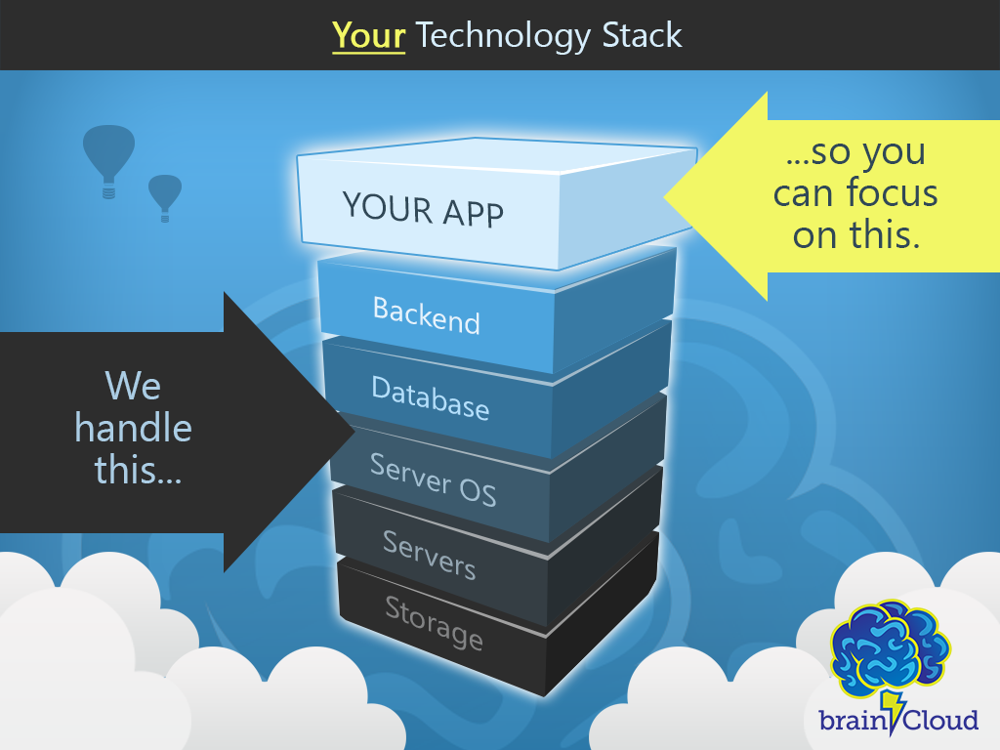

## What is BRAINCLOUD?

**BRAINCLOUD** is a ready-made **back-end platform** for the development of feature-rich **mobile+social games** and **gamified apps**. BRAINCLOUD provides the features you need – along with **comprehensive tools** to support your team during development, testing, and user support.

BRAINCLOUD consists of:

- **Cloud Service** – an advanced, Backend-as-a-Service (BaaS)
- **Client Libraries** – local client libraries (SDKs)
- **Design Portal** – a portal that allows you to design and debug your apps

## SDK libraries

There are custom BRAINCLOUD libraries for:

- **C#** – for Unity and .Net developers
- **C++** – for platform-native apps, on iOS Android, Windows, etc.
- **JS** – for web-based JavaScript apps
- **AS3** – for Flash-based ActionScript apps
- **Java** – for Java-based and native Android apps
- **Objective-C** – for native Mac and iOS apps

## Engine Support

BRAINCLOUD supports the most popular gaming engines, including:

- **Unity** – BRAINCLOUD provides C# libraries, examples and tutorials for integration with Unity
- **Unreal** – we have support for the latest versions of the Unreal Engine
- **Cocos2d-x** – Cocos is supported natively using the C++ libraries

## Understanding the APIs

BRAINCLOUD has a very broad feature-set – you can use as much or as little of it as you like.

This section gives some background on how the BRAINCLOUD APIs work, in terms of concepts and structure. The details on API usage can be found in the [API Reference](/learn/api-reference/) section.

This introduction is organized into the following sections:

- **[Design Portal](/learn/introduction/design-portal/)** – getting started in the system
- **[BRAINCLOUD API](/learn/introduction/braincloud-api/)** – connecting your app to BRAINCLOUD
- **[BRAINCLOUD RTT](/learn/introduction/braincloud-rtt/)** – listen and react to events in real-time
- **[Profiles and Identity](/learn/introduction/profiles-and-identity/)** – how BRAINCLOUD identifies end-users
- **[Cloud Data](/learn/introduction/cloud-data/)** – overview of the BRAINCLOUD data APIs
- **[Gamification](/learn/introduction/gamification/)** – discussion of the BRAINCLOUD gamification features
- **[Multiplayer](/learn/introduction/multiplayer/)** – overview of BRAINCLOUD’s multiplayer capabilities
- **[Push Notifications](/learn/introduction/notifications/)** – sending push notifications (programmatically) in BRAINCLOUD
- **[Currency, Payments, and Promotions](/learn/introduction/currency-and-payments/)** – dealing with virtual currencies, products, pricing and promotions
- **[Leaderboards and Tournaments](/learn/introduction/leaderboards-and-tournaments/)** - discussion of leaderboards, pacers, and tournaments
- **[Cloud Code](/learn/introduction/cloud-code/)**  – writing your own cloud code

<DocCardList />