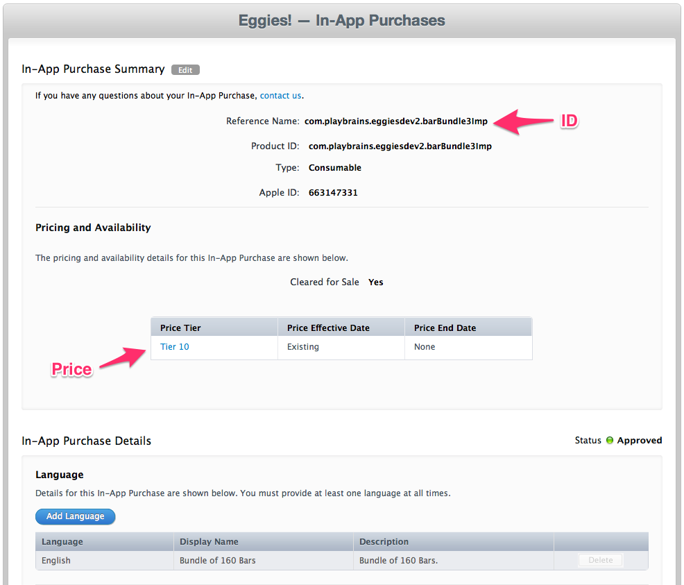

## The Three P's - Products, Pricing, and Promotions

BRAINCLOUD is not an e-commerce platform itself - but it integrates with the various platform stores (iOS AppStore, Google Play, Facebook Store, Steam Store, Windows Store, etc.) to facilitate and secure the purchasing process - while providing advanced support for pricing and promotions.

## Products

BRAINCLOUD's monetization support centers around the purchase of products.  Products are the IAP purchases that a user may make in your app.  For example, in Clash of Clans, the products would be the bundles of coins, elixir, and gems that the user purchases for real money in the store -- not the Cannons and Archer Towers that can be purchased with those products.

Products are often associated with Virtual Currencies, which BRAINCLOUD also provides support for -- but they don't have to be.

## Pricing

Products in BRAINCLOUD can have multiple price points (called Price Entries) - just like in a physical retail store.  The regular or default price is called the **List Price**, while the other prices are defined and available for use in **Promotional Sales**.

Price Entries are used to tie BRAINCLOUD Products to the product/pricing info of the Platform Stores (like the iOS App Store).

  
Each AppStore works differently - in iOS, all price points must be defined ahead of time in iTunes Connect.  Google Play and Windows Store work this way too.  In Facebook and Steam, however, the product prices are controlled directly by BRAINCLOUD and provided to the store upon request.  Although the exact details vary by store - BRAINCLOUD allows you to manage the pricing of your products centrally across all platforms.

## Promotions

Building upon Products and Pricing are the Promotions features - which allow you to present your users with "special offers" of preferred pricing of products, or even exclusive products that aren't normally available.

BRAINCLOUD provides two forms of promotions:

- Scheduled Promotions - promotions that are to be offered during specific calendar dates - such as a "Christmas Holiday Sale"
- Automated Promotions - promotions that are offered to a specific target segment of users, and triggered as each individual user enters that segment (i.e. "New User" promotion for users who activated the game less than 5 days ago)

## More Information

For more information, consult the BRAINCLOUD [Product](/api/capi/product) API.
