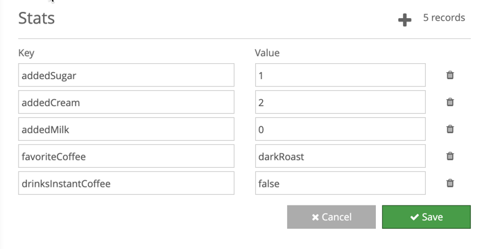

Attributes are tags (key+value pairs) that can be assigned to a user either manually or programmatically. They are primarily (but not exclusively)  used in defining and filtering segments for Promotions.

To add a new Attribute simply click the plus icon in the top right next to the record count.  The keys and values of any of the attributes can be edited directly in the list.  To delete an Attribute click the trash icon to the right of it.  None of these actions are applied until the **Save** button is pressed.  That means by pressing **Cancel** you can revert any changes you made from the last time you saved.
