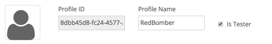
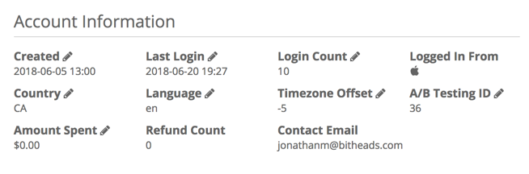
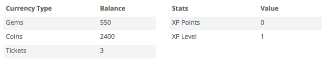
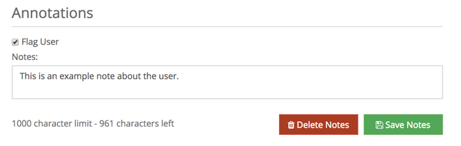
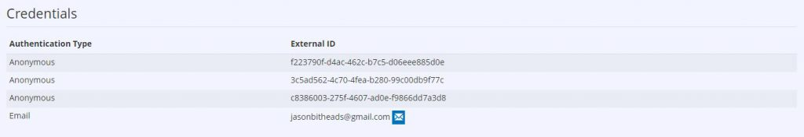
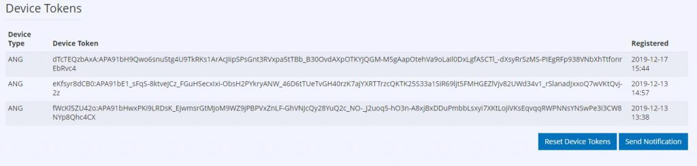

This tab displays a summary of key information about the selected User. You can even flag users and add notes to make them easier to look up later. We will go through all the features of this page from top to bottom.

Right at the top, you can see the User's profile picture (or a placeholder if they have none), their unique Profile ID, and their Profile Name (which is editable from here).  

Right next to this field is a checkbox marked **Is Tester**. This is a very useful tool for testing your App and debugging many issues. For example, it can be used in your app to enable/disable features specific for testers. The isTester value can be found from the [ReadUserState](/api/capi/playerstate/readuserstate) API Call.

After checking the Is Tester box on the user Profile, you will notice small pencil icons appear next to many pieces of information on the page.

Clicking on those icons allows you to directly edit those fields. To save your changes click the green **Save User** button in the upper right of the page.

Other than the **Save User** button (which as described above will save any edits you have made to the User) there are two other buttons at the top of the page.  The **Reset User** button will delete all user data **except** User Currency, User Credentials, and User Transactions (i.e. Product Purchases).  The **Delete User** button will **permanently** delete the User (this action cannot be undone!).

The **Login As User** button under the profile picture, will take you to the **API Explorer** page and automatically authenticate you as the current user. This makes debugging API calls as a specific user very easy to do.

The next section, **Account Information**, contains some key information about the User.  If **Is Tester** is enabled many of these fields can be edited.

Below that is the **Account Details** section which displays a summary of the User's currencies and stats.

The **Annotations** section allows you to flag the user for easier locating in the future.  You can also add notes to refer to at a later time.  After you're done adding notes be sure to click the **Save Notes** button.  If you want to discard your notes click the **Delete Notes** button.

The next section is the **Credentials**. From here you can see all the User's attached Identities including the Authentication Type and the corresponding ID.  

The final section is the **Device Tokens** (only shows up when you registered a notification device to this user). At the bottom of this section are two more buttons.  **Send Notification** allows you to send a custom push notification message to all the User's registered notification methods.  **Reset Device Tokens** allows you to delete all the registered device tokens.
