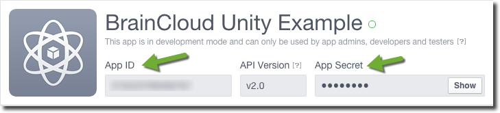

In order for your app to connect with Facebook, you will need to do the steps below.

### Facebook Authentication

- Go to the BRAINCLOUD Portal and open the Design | Core App Info | Application IDs page  
    
    
    
- Click the Facebook icon  
    
    
    
- Log into the [Facebook Developer Portal](https://developers.facebook.com) for your app
- Collect the "App ID" and "App Secret" from the Facebook Developer Portal Dashboard page  
    
    
    
- Go back to the BRAINCLOUD portal and fill in the following information  
    
    
    
    - Facebook App ID - The App ID from your Facebook app dashboard page
    - Facebook Secret - The Secret from your Facebook app dashboard page
- Ensure that "Facebook" is turned on as a Platform in your Design | Core App Info | Platforms page  
    
    
    
      
    
    
    
- You should now be able to use Facebook Authentication in your app. For further information in regard to implementing Facebook Authentication, refer to [this linked article](http://help.getbraincloud.com/en/articles/4668095-authenticate-facebook) in our knowledge base help center.
