In this tutorial, we'll look at integrating the iTunes iOS store with the BRAINCLOUD marketplace. By doing this, iOS users will have the ability to purchase iTunes iOS items. The BRAINCLOUD backend will verify the purchase directly with iTunes, making this a secure transaction for your app.

Note that apps still have to make the purchase directly with iTunes. For more information on this process refer to the Apple developer [In-App Purchase Programming Guide](https://developer.apple.com/library/ios/documentation/NetworkingInternet/Conceptual/StoreKitGuide/Introduction.html).

## Purchase Flow

In general terms, the transaction flow of a purchase is as follows:

[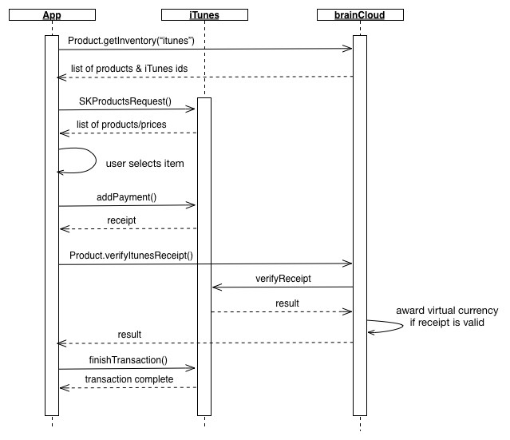](images/iTunes-Purchase-Sequence-Diagram1.jpg)

- The App requests the "itunes" product inventory from BRAINCLOUD which returns a list of products, their reference prices (as configured in the BRAINCLOUD portal) and their iTunes ids.
- For the iTunes products returned from BRAINCLOUD, the App requests their real prices (in the user's currency) from iTunes.
- The user selects an item to purchase
- The App sends a request to iTunes to addPayment which brings up the iTunes purchase dialogs in your app. Eventually, a receipt is returned from iTunes assuming the user goes through with the purchase.
- The App asks BRAINCLOUD to verify the iTunes receipt that was received from the iTunes store. Assuming this is a valid receipt, BRAINCLOUD will award any virtual currencies attached to this product.
- The App finishes the transaction with iTunes to signify that the product has been awarded.

## Portal Setup

Here are the steps to configure BRAINCLOUD for iTunes purchases.

### Prerequisites

- You should have set up your products in the BRAINCLOUD marketplace. Please refer to the [Marketplace Configuration](/learn/portal-tutorials/marketplace-configuration/) guide.
- You should have created the iTunes In-App products per the Apple Developer documentation

### Associate iTunes Products with BRAINCLOUD Products

After setting up your products in the BRAINCLOUD marketplace, you'll want to associate the iTunes product ids. In particular, we will be grabbing the product ids from iTunes and entering them into the appropriate BRAINCLOUD products.

- Log into [iTunes Connect](https://itunesconnect.apple.com/)
- Select your App from the list and go to the "In-App Purchases" tab
- Select your IAP and grab the Apple Product ID  
    
    [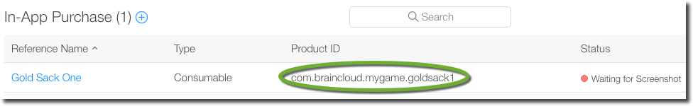](images/2015-11-10_12-02-52.png)
    
- Log into the [BRAINCLOUD Portal](https://portal.braincloudservers.com/)
- Go to the "Marketplace | Products" page in the Design tab  
    
    [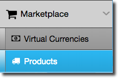](images/2015-08-10_08-36-53.png)
    
- Select the product you would like to associate.  
    
    [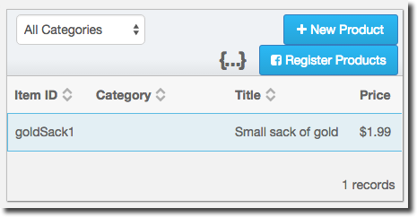](images/2015-08-11_12-32-21.png)
    
- Click the "+ Edit Product" button  
    
    [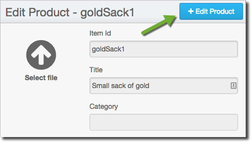](images/2015-08-11_12-33-07.png)
    
- Find your Price (or create one) and click the edit icon  
    
    [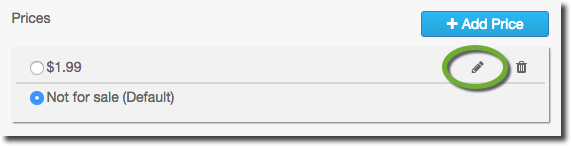](images/2015-08-11_12-48-07.png)
    
- In the Edit Price dialog, click the + icon to add an entry for Apple  
    
    [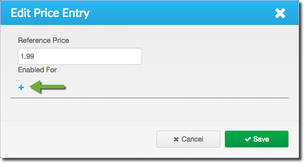](images/2015-08-11_12-49-42.png)
    
- Enter your iTunes product id for this price - in our case "com.braincloud.mygame.goldsack1". Note that you can enter separate iPhone/iPad ids if your app is \*not\* a universal binary (or for some other reason uses two different product ids)  
    
    [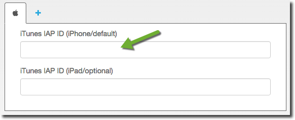](images/2015-08-11_12-51-33.png)
    
- At this point you may want to select your price to be the default if it isn't already selected. You can do this back in the Edit Product page.  
    
    [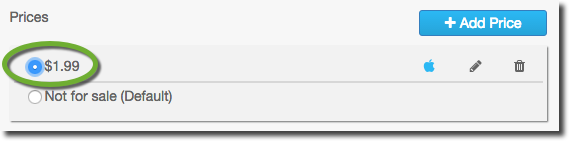](images/2015-08-11_12-56-25.png)
    
- You can now verify that your Product is coming back with the correct iTunes id. Here is the output from the API Explorer "Product.GetInventory" call  
    
    [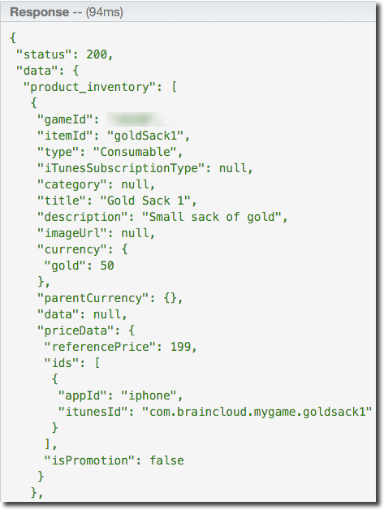](images/2015-11-10_12-06-45.png)
    

### Auto-Renewable Subscriptions

If you are using auto-renewable subscriptions, you will need to add your iTunes IAP shared secret to BRAINCLOUD.

- Log into [iTunes Connect](https://itunesconnect.apple.com/)
- Select your App from the list and go to the "In-App Purchases" tab
- Click the "View or generate a shared secret" link at the bottom of the IAP list  
    
    [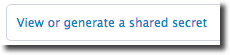](images/2015-08-11_10-27-14.png)
    
- Grab the shared secret from the page (or generate a new one if none exists)  
    
    [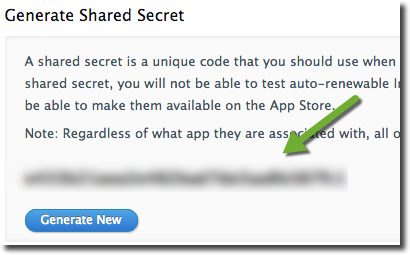](images/2015-08-11_10-28-151.png)
    
- Log into the [BRAINCLOUD Portal](https://portal.braincloudservers.com/)
- Go to the "Core App Info | Application IDs" page in the Design tab for your app  
    
    [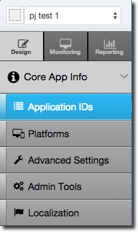](images/2015-08-07_14-05-15.png)
    
- Click the Apple button  
    
    [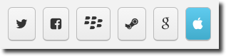](images/2015-08-11_12-15-061.png)
    
- Enter the iTunes Shared Secret  
    
    [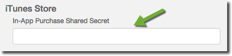](images/2015-08-11_12-16-45.png)
