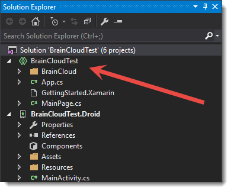

BRAINCLOUD supports both Android and iOS development through Xamarin (Windows, Windows Phone, and UWP are not yet supported).  This tutorial goes through the steps of adding the BRAINCLOUD .NET library to a Xamarin Shared Project.

## Preparing & Including The Library

The first step is to download the latest BRAINCLOUD library from GitHub:  https://github.com/getbraincloud/Unity-Csharp

From there we need to remove some non-Xamarin compatible files from the library.

- Navigate to the BrainCloudClient | src directory and move the BrainCloud folder to another location (like your desktop)
- Inside the BrainCloud folder, delete the following directories:
    - LitJson
    - Unity

Finally, we can add the library to the shared code project.  Drag and drop the BrainCloud folder onto the shared code project in Visual Studio and it will automatically be copied to the correct directory and added to the project.

That's all the setup needed to add the BRAINCLOUD library to your project! Now you can get started using BRAINCLOUD in your app.
