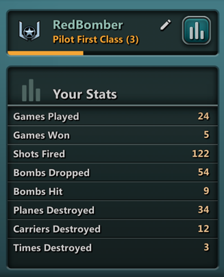
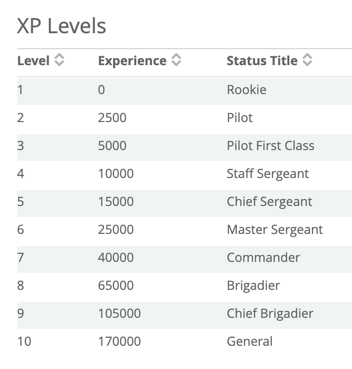
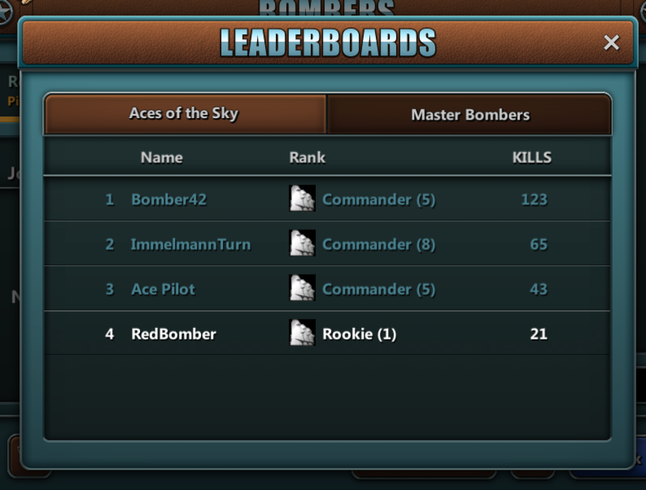
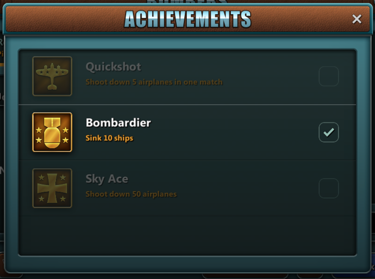
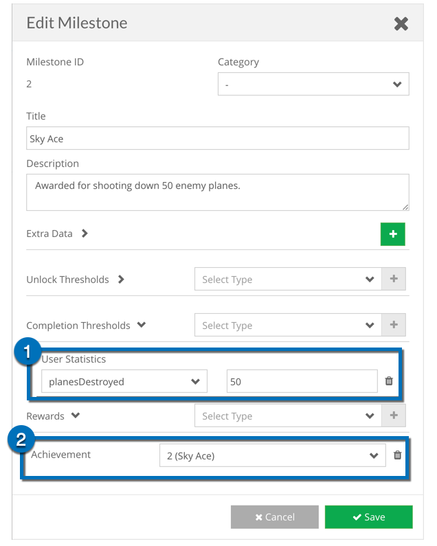
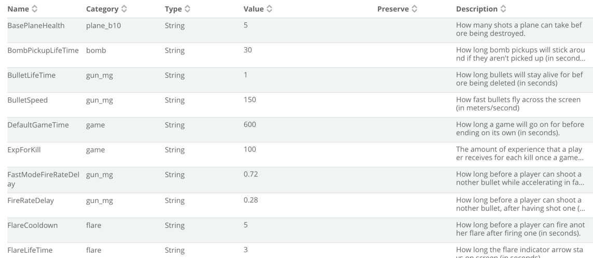

BRAINCLOUD Bombers is an example project meant to show how to use BRAINCLOUD for real-time multiplayer. Players create accounts, log into the game, play against other players in real-time multiplayer battles, and their stats are saved between sessions via BRAINCLOUD. The example also shows various features of BRAINCLOUD, including:

- Experience levels and ranking up
- Custom player statistics and entities
- Multiple global leaderboards
- Achievement tracking and unlocking
- Global properties

Please refer to the specific individual sections for some description, overview, and functionality of each feature.  

## **Experience Levels and Ranking Up**

In BRAINCLOUD Bombers, players can earn experience for destroying enemy planes in-game. Experience is awarded at the end of each match and kept track of on the BRAINCLOUD servers. Players can view their total experience on the Matchmaking menu, beneath the player’s name. BRAINCLOUD also has custom levels defined, each having an experience value and a name. Players can see their current rank (as well as its numeric value) on the Matchmaking menu, beneath the player’s name. Experience is incremented live, so BRAINCLOUD sends messages to clients when they have made it to the next rank. This is shown to the player through a dialog that appears at the end of a match.

Experience and levels can be read through the PlayerStateService in the BRAINCLOUD API. The call returns the current player’s experience level and rank name/numeric value, all of which are saved as public member variables in the BrainCloudStats class. These stats are updated live on the BRAINCLOUD server, but on the local client, they are only updated when the player visits the Matchmaking menu, reducing the number of API calls required per user.

## **Custom Player \[User\] Statistics**

Every player in BRAINCLOUD bombers has a number of custom statistics that are stored on the BRAINCLOUD servers. These statistics include the number of ships they have sunk, the number of times they have fired their weapon, their total number of wins, and more. These statistics are updated at the end of each match. Players can view their statistics on the Matchmaking menu, where they are shown on the left side, below the player’s name. These statistics were created on the BRAINCLOUD design portal, and can also be edited from the monitoring section of the portal for each user.

Player statistics can be read through the PlayerStatisticsService in the BRAINCLOUD API. The call returns all of the current player’s statistics, including the statistics’ name, value, and description (all defined from the BRAINCLOUD dashboard), of which only the value is saved in public member variables in the BrainCloudStats class. These stats are updated live on the BRAINCLOUD server, but on the local client, they are only updated when the player visits the Matchmaking menu, reducing the number of API calls required per user.

## **Global Leaderboards**

BRAINCLOUD Bombers has two separate global leaderboards defined, that players may view at their leisure from the Matchmaking menu. The first leaderboard keeps track of the number of enemy plane takedowns that each player has, with the least number of deaths as the tiebreaker, and the second leaderboard keeps track of the number of ship weak-points destroyed by each player, with the least number bombs dropped as the tiebreaker. Both leaderboards feature the player’s place in the leaderboard, name, their rank (and numeric value of rank), and score. BRAINCLOUD keeps tracks of all aspects of the leaderboards, and scores are updated at the end of each match.

Leaderboards can be accessed through the SocialLeaderboardService in the BRAINCLOUD API. The call returns the entire listing of a given leaderboard or can be broken up into just the current player’s score, or individual sections of the leaderboard with variable length. The values for the currently observed leaderboard are stored as a public member variable in the BrainCloudStats class. The leaderboards are updated live on the BRAINCLOUD server, but on the local client, the leaderboards are only fetched when the player wishes to see them from the Matchmaking menu, reducing the number of API calls required per user.

## Achievement Tracking

Three achievements have been implemented for BRAINCLOUD Bombers: destroying 50 enemy planes, sinking 10 ships, and destroying five enemy planes in a single match. BRAINCLOUD tracks whether the achievements have been unlocked or not, and can even automatically award the achievements based on player stats using Milestones. At the end of the match, bombers sends the stats updates to BRAINCLOUD, and then checks the response to see if any Achievements have been awarded.  \[Exception: note that the Quickshot achievement is handled manually by the client code in real-time during the match.\]

Achievements can be accessed through the GamificationService in the BRAINCLOUD API. The call returns all of the achievements in the system, their names, the urls for their icons, their descriptions, and whether or not the current user has unlocked any of them. The achievement data is stored in a public member variable in the BrainCloudStats class. The achievements are updated from the server when the player visits the Matchmaking menu.

 1. When this condition is satisfied.   
2\. Award this achievement.

## Global Properties

BRAINCLOUD Global Properties can be used in place of constants in your games – allowing games to be tuned and/or patched on the fly without having to release new builds. A number of properties have been utilized in BRAINCLOUD Bombers, to tune such things as player fire rate, respawn time, bullet speed, player health, and more.

These properties can be read through the GlobalAppService in the BRAINCLOUD API. The call returns all of the currently saved global variables, which are then stored as public member variables in the BrainCloudStats class. To reduce API calls from the client, these values are only read once when the game is started, meaning clients will need to restart the app to get any changes, but they could be checked more often for the sake of app security or faster testing.

Global Properties
